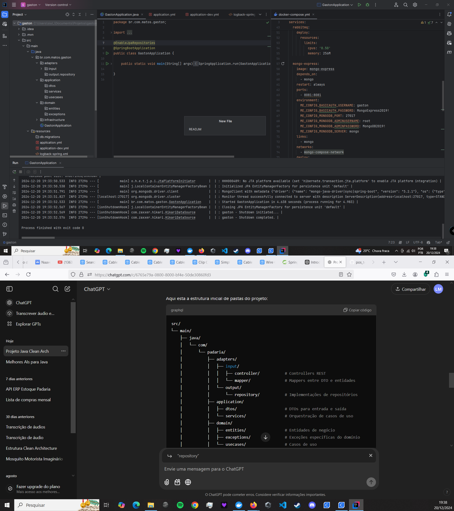

src/
└── main/
├── java/
│   └── com/
│       └── padaria/
│           ├── adapters/
│           │   ├── input/
│           │   │   ├── controller/           # Controllers REST
│           │   │   └── mapper/               # Mappers entre DTO e entidades
│           │   └── output/
│           │       └── repository/           # Implementações de repositórios
│           ├── application/
│           │   ├── dtos/                     # DTOs para entrada e saída
│           │   └── services/                 # Orquestração de casos de uso
│           ├── domain/
│           │   ├── entities/                 # Entidades de negócio
│           │   ├── exceptions/               # Exceções específicas do domínio
│           │   └── usecases/                 # Casos de uso
│           └── infrastructure/
│               ├── config/                   # Configurações do Spring Boot
│               ├── database/
│               │   ├── entities/             # Entidades do banco (JPA)
│               │   └── repositories/         # Interfaces de repositórios (JPA)
│               └── http/
│                   └── client/               # Integrações com APIs externas (se necessário)
└── resources/
├── application.properties                # Configurações do Spring Boot
└── db/
└── migrations/                       # Scripts de migração (Flyway)
